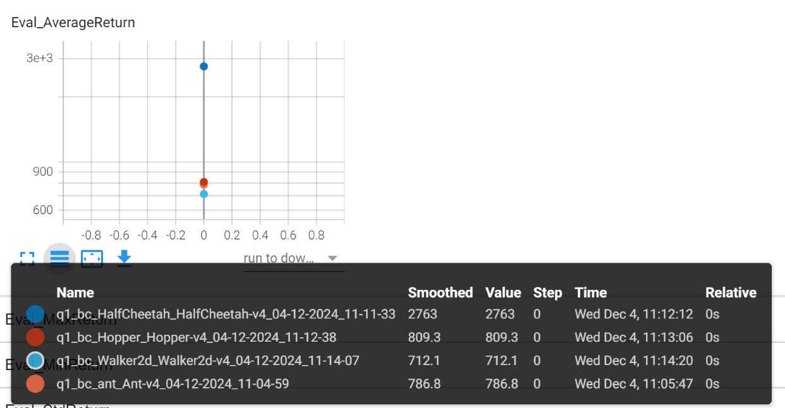
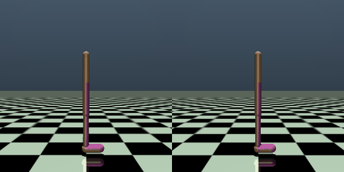
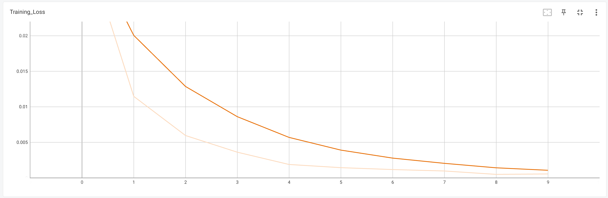
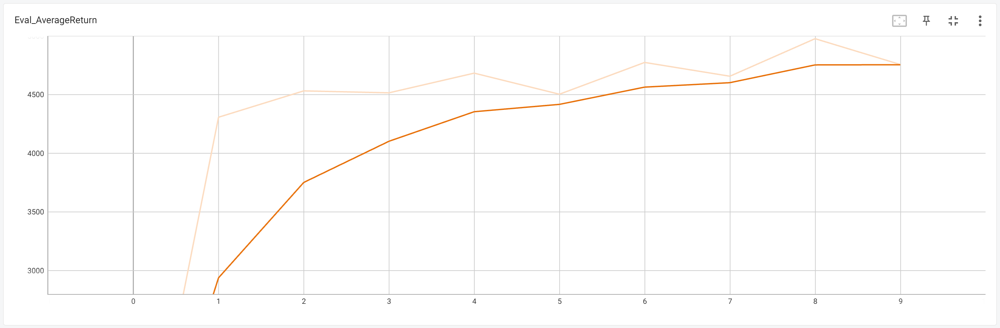

# Homework 1

## 1 Analysis 

To be completed. (┬┬﹏┬┬)

## 2 Editing Code 

Finished.

NOTE: A few changes were made to documents other than those requested, mainly to adjust the specification of `if` statements.   

```
# conda-forge 
conda-forge::mujoco=2.2.0 
conda-forge::tensorboard=2.10.0
conda-forge::tensorboardX=2.5.1
conda-forge::matplotlib=3.5.3 
conda-forge::moviepy=1.0.3
conda-forge::pyvirtualdisplay=3.0
conda-forge::ipdb=0.13.9
conda-forge::swig=4.0.2
conda-forge::box2d-py=2.3.8

# conda-forge but different versions  
# gym==0.25.2
conda-forge::gym=0.26.1	
# ipython==7.34.0 
conda-forge::ipython=7.33.0	

# not conda-forge 
pytorch::pytorch=1.12.1  
fastai::opencv-python-headless=4.6.0.66  
```

## 3 Behavioral Cloning

NOTE: To prevent a `ModuleNotFoundError: No module named 'cs285'`, do set a temporary environment variable\. 

```powershell
$env:PYTHONPATH = "$env:PYTHONPATH;path\\to\\homework\\hw1" 
```

### 1 Results

 

#### Ant

```powershell
python cs285/scripts/run_hw1.py --expert_policy_file cs285/policies/experts/Ant.pkl --env_name Ant-v4 --exp_name bc_ant --n_iter 1 --expert_data cs285/expert_data/expert_data_Ant-v4.pkl --video_log_freq -1 
```

```powershell
Eval_AverageReturn : 656.7374877929688
Eval_StdReturn : 0.0
Eval_MaxReturn : 656.7374877929688
Eval_MinReturn : 656.7374877929688
Eval_AverageEpLen : 1000.0
Train_AverageReturn : 4681.891673935816
Train_StdReturn : 30.70862278765526
Train_MaxReturn : 4712.600296723471
Train_MinReturn : 4651.18305114816
Train_AverageEpLen : 1000.0
Training Loss : 0.03436639532446861
Train_EnvstepsSoFar : 0
TimeSinceStart : 4.244591236114502
Initial_DataCollection_AverageReturn : 4681.891673935816 
```


#### HalfCheetah

```powershell
python cs285/scripts/run_hw1.py --expert_policy_file cs285/policies/experts/HalfCheetah.pkl --env_name HalfCheetah-v4 --exp_name bc_HalfCheetah --n_iter 1 --expert_data cs285/expert_data/expert_data_HalfCheetah-v4.pkl --video_log_freq -1  
```

```powershell
Eval_AverageReturn : 3104.907470703125
Eval_StdReturn : 0.0
Eval_MaxReturn : 3104.907470703125
Eval_MinReturn : 3104.907470703125
Eval_AverageEpLen : 1000.0
Train_AverageReturn : 4034.7999834965067
Train_StdReturn : 32.8677631311341
Train_MaxReturn : 4067.6677466276406
Train_MinReturn : 4001.9322203653724
Train_AverageEpLen : 1000.0
Training Loss : 0.04342726245522499
Train_EnvstepsSoFar : 0
TimeSinceStart : 3.7462668418884277
Initial_DataCollection_AverageReturn : 4034.7999834965067 
```


#### Hopper

```powershell
python cs285/scripts/run_hw1.py --expert_policy_file cs285/policies/experts/Hopper.pkl --env_name Hopper-v4 --exp_name bc_Hopper --n_iter 1 --expert_data cs285/expert_data/expert_data_Hopper-v4.pkl --video_log_freq -1
```

```powershell
Eval_AverageReturn : 913.7670288085938
Eval_StdReturn : 427.685302734375
Eval_MaxReturn : 1493.56103515625
Eval_MinReturn : 297.77008056640625
Eval_AverageEpLen : 297.75
Train_AverageReturn : 3717.5129936182307
Train_StdReturn : 0.3530361779417035
Train_MaxReturn : 3717.8660297961724
Train_MinReturn : 3717.159957440289
Train_AverageEpLen : 1000.0
Training Loss : 0.04094276204705238
Train_EnvstepsSoFar : 0
TimeSinceStart : 4.0487284660339355
Initial_DataCollection_AverageReturn : 3717.5129936182307
```


#### Walker2d 

```powershell
python cs285/scripts/run_hw1.py --expert_policy_file cs285/policies/experts/Walker2d.pkl --env_name Walker2d-v4 --exp_name bc_Walker2d --n_iter 1 --expert_data cs285/expert_data/expert_data_Walker2d-v4.pkl --video_log_freq -1
```

```powershell
Eval_AverageReturn : 662.3567504882812
Eval_StdReturn : 560.3404541015625
Eval_MaxReturn : 1868.0704345703125
Eval_MinReturn : 230.56932067871094
Eval_AverageEpLen : 196.33333333333334
Train_AverageReturn : 5383.310325177668
Train_StdReturn : 54.15251563871789
Train_MaxReturn : 5437.462840816386
Train_MinReturn : 5329.1578095389505
Train_AverageEpLen : 1000.0
Training Loss : 0.054073404520750046
Train_EnvstepsSoFar : 0
TimeSinceStart : 3.919442653656006
Initial_DataCollection_AverageReturn : 5383.310325177668
```



### 2 Comparation between Hyperparameters

The result shows that expert data of `batch_size=1000` is enough to train a good policy.  

However, the training does not converge when `num_agent_train_steps_per_iter=1000`.

When we increase the training steps, the policy improves a lot.

Even more data is added, the policy does not improve due to insufficient steps for convergence. 

#### Original  

```powershell
python cs285/scripts/run_hw1.py --expert_policy_file cs285/policies/experts/Walker2d.pkl --env_name Walker2d-v4 --exp_name bc_Walker2d --n_iter 1 --expert_data cs285/expert_data/expert_data_Walker2d-v4.pkl --video_log_freq -1 
```

```powershell
Eval_AverageReturn : 662.3567504882812
Eval_StdReturn : 560.3404541015625
Eval_MaxReturn : 1868.0704345703125
Eval_MinReturn : 230.56932067871094
Eval_AverageEpLen : 196.33333333333334
Train_AverageReturn : 5383.310325177668
Train_StdReturn : 54.15251563871789
Train_MaxReturn : 5437.462840816386
Train_MinReturn : 5329.1578095389505
Train_AverageEpLen : 1000.0
Training Loss : 0.054073404520750046
Train_EnvstepsSoFar : 0
TimeSinceStart : 3.919442653656006
Initial_DataCollection_AverageReturn : 5383.310325177668 
```

#### The Amount of Training Steps

```powershell
python cs285/scripts/run_hw1.py --expert_policy_file cs285/policies/experts/Walker2d.pkl --env_name Walker2d-v4 --exp_name bc_Walker2d --n_iter 1 --expert_data cs285/expert_data/expert_data_Walker2d-v4.pkl --num_agent_train_steps_per_iter 5000 
```

```powershell
Eval_AverageReturn : 4969.92529296875
Eval_StdReturn : 329.91845703125
Eval_MaxReturn : 5299.84375
Eval_MinReturn : 4640.0068359375
Eval_AverageEpLen : 952.0
Train_AverageReturn : 5383.310325177668
Train_StdReturn : 54.15251563871789
Train_MaxReturn : 5437.462840816386
Train_MinReturn : 5329.1578095389505
Train_AverageEpLen : 1000.0
Training Loss : 0.009046594612300396
Train_EnvstepsSoFar : 0
TimeSinceStart : 56.9373722076416
Initial_DataCollection_AverageReturn : 5383.310325177668
```

#### The Amount of Expert Data Provided 

```powershell
python cs285/scripts/run_hw1.py --expert_policy_file cs285/policies/experts/Walker2d.pkl --env_name Walker2d-v4 --exp_name bc_Walker2d --n_iter 1 --expert_data cs285/expert_data/expert_data_Walker2d-v4.pkl --batch 10000 
```

```powershell
Eval_AverageReturn : 712.1009521484375
Eval_StdReturn : 602.9308471679688
Eval_MaxReturn : 1868.0704345703125
Eval_MinReturn : 208.79051208496094
Eval_AverageEpLen : 205.8
Train_AverageReturn : 5383.310325177668
Train_StdReturn : 54.15251563871789
Train_MaxReturn : 5437.462840816386
Train_MinReturn : 5329.1578095389505
Train_AverageEpLen : 1000.0
Training Loss : 0.054073404520750046
Train_EnvstepsSoFar : 0
TimeSinceStart : 10.233949661254883
Initial_DataCollection_AverageReturn : 5383.310325177668 
```

## 4 DAgger

```powershell
python cs285/scripts/run_hw1.py --expert_policy_file cs285/policies/experts/Ant.pkl --env_name Ant-v4 --exp_name dagger_ant --n_iter 10 --do_dagger --expert_data cs285/expert_data/expert_data_Ant-v4.pkl --video_log_freq -1
```




